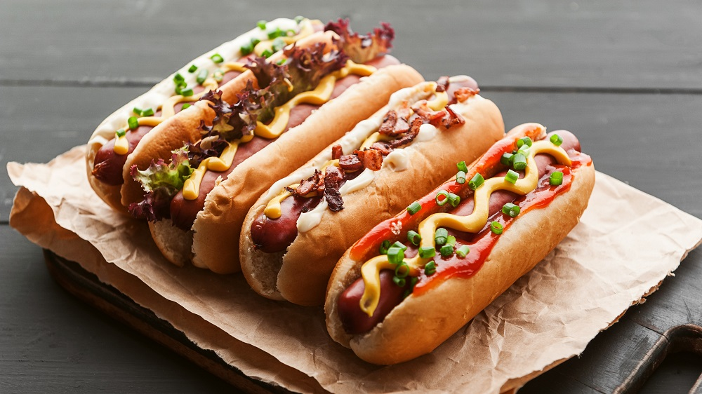

# Improved Hotdog Classifier

If you're a fan of HBO's comedy show _Silicon Valley_ you may remember the startup called _Seefood_. The idea was taking a photo of a certain food, the app recognizes it then gives you information about the food. The whole story went well except that _Jian Yang_, the mastermind behind the app, only made it for hotdogs.

The code I wrote in the Jupyter notebook you can find in this particular repository, is the right way of creating an app like _Seefood_.

## TODO List

- [ ] Writing a blog post about the process (Persian)
- [ ] Writing a blog post about the process (English)
- [ ] Testing the model with more data
- [ ] Testing the model with more iterations
- [ ] Testing the model with different batch sizes